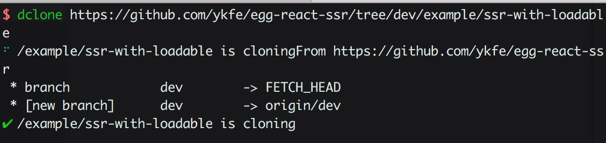

简体中文 | [English](./README.md)

# 下载github仓库中的指定文件夹

使用dclone命令可以方便我们只下载github仓库中的指定文件夹而不是全部的文件,可以大幅度缩短你的下载时间


## 如何使用

非常简单，你只需要找到你需要下载的文件夹的github url地址即可


```bash
$ npm i -g dclone
$ dclone https://github.com/ykfe/egg-react-ssr/tree/dev/example/ssr-with-loadable
```

