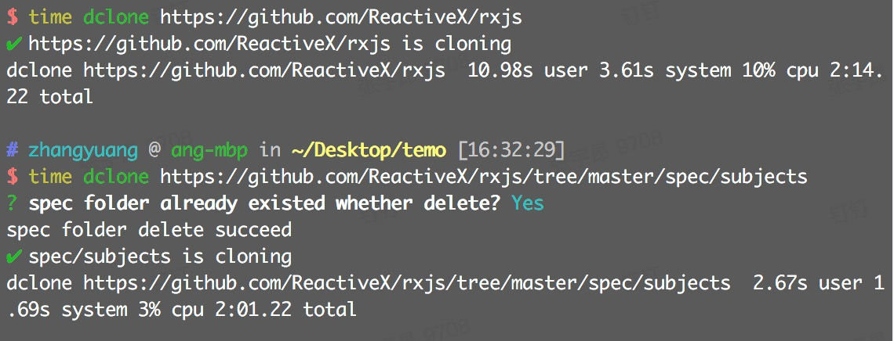

简体中文 | [English](./README.md)

# 下载github/gitlab中指定的文件夹

<a href="https://circleci.com/gh/ykfe"></a>
<a href="https://codecov.io/gh/ykfe/dclone"></a>
<a href="https://npmcharts.com/compare/dclone"></a>
<a href="https://standardjs.com"></a>
<a href="https://github.com/facebook/jest"></a>
<a href="https://github.com/ykfe/egg-react-ssr"></a>


dclone是最简单的命令去下载github/gitlab仓库中指定的文件夹或者整个仓库(使用依赖git)，使用上可以完全替代`git clone`, 你可以用它来缩短你的下载速度

## 特性

让我们来介绍一下dclone有哪些特点吧

- 你可以只下载单独的一个文件夹大大缩短你的下载速度
- 全面，同时兼容github和gitlab
- 简单，你只需要复制地址栏的链接即可



## 如何使用

非常简单，你只需要找到你需要下载的文件夹的github url地址即可


```bash
$ npm i -g dclone
$ dclone https://github.com/ykfe/egg-react-ssr/tree/dev/example/ssr-with-loadable
```

