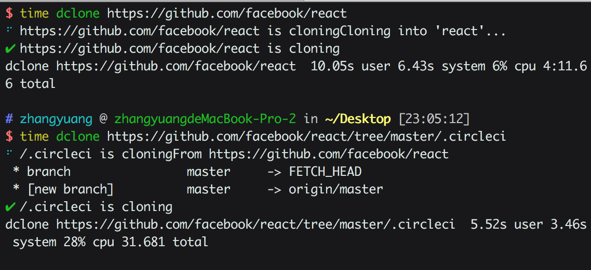
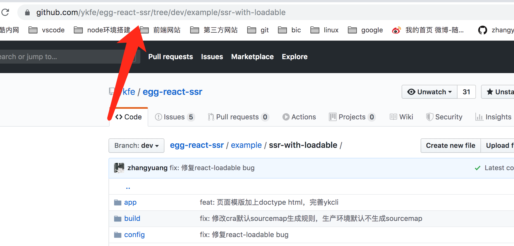

简体中文 | [English](./README.md)

# 下载github中指定的文件夹

<a href="https://circleci.com/gh/ykfe"></a>
<a href="https://codecov.io/gh/ykfe/dclone"></a>

dclone使用了最简单的实现去下载github仓库中指定的文件夹依赖git，你可以用它来缩短你的下载速度



## 如何使用

非常简单，你只需要找到你需要下载的文件夹的github url地址即可



```bash
$ npm i -g dclone
$ dclone https://github.com/ykfe/egg-react-ssr/tree/dev/example/ssr-with-loadable
```

